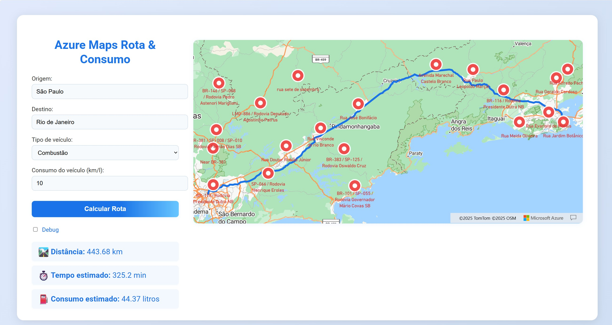

# Azure Maps Flask Sample Application

This is a sample Python Flask web application that demonstrates how to interact with Azure Maps. The app allows users to calculate routes, estimate fuel or electric efficiency, and view real-time traffic incidents on a map.



## Features
- **Route Calculation:** Get driving routes between two locations using Azure Maps.
- **Efficiency Calculation:** Enter your vehicle's fuel (km/l) or electric (km/kWh) efficiency to estimate consumption for the route.
- **Traffic Incidents:** View real-time incidents along the route, with visually enhanced popups.
- **Modern UI:** Responsive, user-friendly interface.
- **Azure Maps Integration:** All map and route data is powered by Azure Maps.

## Prerequisites & Costs
- **Azure Subscription** (resources deployed will incur costs)
- **Azure Maps Resource** (deployed automatically by the Bicep template)
- **App Service Plan & Web App** (deployed automatically)

> ⚠️ **Note:** Azure Maps, App Service, and related resources have associated costs. Review the [Azure Maps pricing](https://azure.microsoft.com/pricing/details/azure-maps/) and [App Service pricing](https://azure.microsoft.com/pricing/details/app-service/) before deploying.

## Getting Started

1. **Clone the repository**
   ```sh
   git clone https://github.com/richardsonbq/azuremaps-sample.git
   cd POCAzureMaps
   ```
2. **Configure environment variables (for local use)**
   - Copy `.env.example` to `.env` and fill in your Azure Maps key (if running locally).

3. **Install dependencies**
   ```sh
   pip install -r requirements.txt
   ```

4. **Run locally**
   ```sh
   flask run
   ```
   The app will be available at `http://localhost:5000`.

## Deploy to Azure (One-Click)

You can deploy this app and all required Azure resources (including Azure Maps) using the Bicep template below.

[](https://portal.azure.com/#create/Microsoft.Template/uri/https%3A%2F%2Fraw.githubusercontent.com%2Fyour-org%2FPOCAzureMaps%2Fmain%2Finfra%2Fmain.bicep)

### Bicep Deployment Steps
1. Click the **Deploy to Azure** button above.
2. Fill in the required parameters:
   - **appLocation**: Region for the App Service (web app)
   - **mapsLocation**: Region for Azure Maps (fewer regions available)
   - **appName**: Name for your app
3. After deployment, your app will be live and ready to use.

## Infrastructure as Code (Bicep)

The `infra/main.bicep` file provisions:
- Azure Maps account (with CORS enabled)
- Azure App Service Plan
- Azure Web App (for Flask app)

---

## Deploying Your Flask App Code to Azure Web App

After deploying the infrastructure with the Bicep template, you must deploy your Flask app code to the provisioned Azure Web App. Below are detailed instructions for deploying directly from your GitHub repository or using the Azure CLI.

### Option 1: Deploy from GitHub Repository (Recommended)
1. Push your code to a public or private GitHub repository (e.g., `https://github.com/richardsonbq/azuremaps-sample.git`).
2. In the Azure Portal, navigate to your **Resource Group** and select your **App Service** (Web App).
3. In the left menu, select **Deployment Center**.
4. Choose **GitHub** as the source, then authenticate and select your repository and branch (e.g., `main`).
5. Azure will automatically set up a GitHub Actions workflow or Kudu deployment for you. You can review and customize the workflow in your repo under `.github/workflows/`.
6. Once the deployment completes, your app will be live at the Web App URL output by the Bicep deployment.

> **Example:**
> - Repository: `https://github.com/richardsonbq/azuremaps-sample.git`
> - Branch: `main`

### Option 2: Deploy via Azure CLI (from Local or GitHub)
#### A. Deploy from Local ZIP (as before)
1. Zip your application files (do not include the `infra/` folder):
   ```sh
   Compress-Archive -Path app.py,requirements.txt,templates -DestinationPath app.zip
   ```
   > On Linux/macOS, use: `zip -r app.zip app.py requirements.txt templates`
2. Deploy the ZIP to your Web App (replace `<app-name>` and `<resource-group>`):
   ```sh
   az webapp deploy --resource-group <resource-group> --name <app-name> --src-path app.zip
   ```

### Option 3: Deploy Directly from GitHub (Continuous Deployment)
You can configure your Web App to pull code directly from your GitHub repository:

```sh
az webapp deployment source config --name <app-name> --resource-group <resource-group> \
  --repo-url https://github.com/richardsonbq/azuremaps-sample.git --branch main --manual-integration
```
- Replace `<app-name>` and `<resource-group>` with your actual values.
- This sets up continuous deployment: every push to the specified branch will trigger a deployment.

---

## Troubleshooting
- If you see a default Azure page or errors, check the **App Service Logs** in the Azure Portal.
- Ensure your `requirements.txt` includes all necessary dependencies.
- Make sure the `AZURE_MAPS_KEY` app setting is present (it is set by the Bicep template).

---

## Project Structure
- `app.py` - Flask backend
- `templates/index.html` - Main UI
- `requirements.txt` - Python dependencies
- `infra/main.bicep` - Bicep IaC for Azure deployment

## License
This project is licensed under the [MIT License](https://opensource.org/licenses/MIT). You are free to use, modify, and distribute this software with proper attribution. See the LICENSE file for details.

---

**This sample demonstrates how to build and deploy a Python web app that interacts with Azure Maps, including route, efficiency, and incident calculations.**

